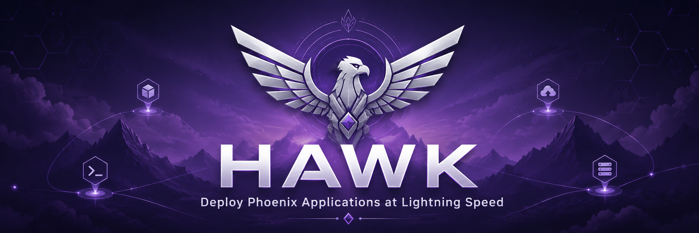

# hawk 🦅



> Zero-dependency deployment for Phoenix applications. If your server has Bash and SSH, hawk works.


## Demo Video


https://github.com/user-attachments/assets/8d845d08-57f6-4e6e-b027-3df6420a54c3


## Why hawk?

Deploying Phoenix applications to a Linux server should not require another language runtime.

Capistrano requires Ruby. Deployer requires PHP. Fabric requires Python. A Phoenix app already has enough moving parts, so hawk keeps deployment in the tools every Linux server already has: Bash and SSH.

The goal is a deploy tool you can read, understand, and change when your application needs something specific.

## Features

- No runtime dependencies beyond Bash, SSH, and the standard tools already present on most Linux servers.
- Capistrano-style releases with timestamped release directories, a `current` symlink, and instant rollback.
- Phoenix-focused deploy flow for Mix releases, migrations, and systemd services.
- ShellCheck-clean Bash code instead of an unstructured deploy script.
- Modular command files, so new commands can be added without rewriting the router.
- Colored terminal output and timestamped logs, so you can see what happened during a deploy.
- Built-in status, logs, doctor, backup, restore, and rollback commands for common operations.

## Requirements

- Bash 4 or newer.
- `git`.
- `ssh`.
- `rsync`.
- A Linux server reachable over SSH.
- A Git repository that the server can clone.
- `systemd` on the server for service management and log inspection.

### For development

- `shellcheck`.

On macOS, the system Bash is usually too old. Install a newer Bash with Homebrew:

```bash
brew install bash
```

## Installation

Clone the repository:

```bash
git clone https://github.com/Null-logic-0/hawk.git
cd hawk
```

Make the CLI executable:

```bash
chmod +x bin/hawk
```

Run it from the repository:

```bash
./bin/hawk --help
```

Or add a symlink somewhere on your `PATH`:

```bash
mkdir -p "$HOME/.local/bin"
ln -sf "$PWD/bin/hawk" "$HOME/.local/bin/hawk"
hawk --help
```

## Quick Start

1. Install hawk:

```bash
git clone https://github.com/Null-logic-0/hawk.git
cd hawk
chmod +x bin/hawk
```

2. Ensure your app has a `Release` module. See the [Phoenix releases guide](https://hexdocs.pm/phoenix/releases.html).

3. Initialize hawk in your Phoenix project:

```bash
hawk init
```

4. Review the generated config:

```bash
cat hawk.conf
```

5. Copy the generated systemd service to the server:

```bash
scp my_app.service deploy@example.com:/tmp/my_app.service
ssh deploy@example.com "sudo mv /tmp/my_app.service /etc/systemd/system/my_app.service"
```

6. Enable the service on the server:

```bash
ssh deploy@example.com "sudo systemctl daemon-reload && sudo systemctl enable my_app"
```

7. Check the setup:

```bash
hawk doctor
```

8. Deploy:

```bash
hawk deploy
```

9. Check the service:

```bash
hawk status
hawk logs
```

## Configuration

hawk reads deployment settings from `hawk.conf` in the current directory or a parent directory. Generate one with:

```bash
hawk init
```

Minimal example:

```bash
APP_NAME=my_app
SERVER_HOST=example.com
SERVER_USER=deploy
SERVER_PORT=22
DEPLOY_PATH=/var/www/my_app
GIT_BRANCH=main
GIT_REPO=git@github.com:example/my_app.git
APP_ENV=production
RELEASES_TO_KEEP=5
RELEASE_MODULE=MyApp
BACKUP_PATH=/var/backups/my_app
DB_USER=my_app
DB_NAME=my_app_prod
```

Required fields:

- `APP_NAME`
- `SERVER_HOST`
- `SERVER_USER`
- `GIT_REPO`
- `DB_USER`
- `DB_NAME`
- `RELEASE_MODULE`

For every config key, defaults, path layout, release module setup, Git access, and backup behavior, see [docs/configuration.md](docs/configuration.md).

## Commands

Show help:

```bash
hawk help
hawk --help
```

Show the installed version:

```bash
hawk version
```

Create `hawk.conf` and a systemd service file:

```bash
hawk init
```

Run setup checks before deploying:

```bash
hawk doctor
```

Deploy the configured branch:

```bash
hawk deploy
```

Show the current release, available releases, and systemd status:

```bash
hawk status
```

Show the last 100 service log lines:

```bash
hawk logs
```

Stream service logs:

```bash
hawk logs --follow
hawk logs -f
```

Roll back to the previous release:

```bash
hawk rollback
```

Create a database and release backup:

```bash
hawk backup
```

Restore from an existing backup:

```bash
hawk restore
```

## Server Requirements

The server needs:

- Bash.
- SSH access for `SERVER_USER`.
- `git` so the server can clone `GIT_REPO`.
- Erlang, Elixir, and Mix versions compatible with the Phoenix app.
- PostgreSQL client tools: `pg_dump` and `psql`.
- `gzip` and `tar` for backups.
- `systemd` for service management.
- Passwordless sudo for `systemctl restart APP_NAME`, or another sudo setup that works in non-interactive SSH commands.
- A writable deploy directory, usually `DEPLOY_PATH`.

Create the deploy directory:

```bash
ssh deploy@example.com "sudo mkdir -p /var/www/my_app/releases && sudo chown -R deploy:deploy /var/www/my_app"
```

Install the generated service:

```bash
scp my_app.service deploy@example.com:/tmp/my_app.service
ssh deploy@example.com "sudo mv /tmp/my_app.service /etc/systemd/system/my_app.service"
ssh deploy@example.com "sudo systemctl daemon-reload && sudo systemctl enable my_app"
```

## Tests

Run the local test suite with Bash 4 or newer:

```bash
bash tests/run_tests.sh
```

On macOS, use Homebrew Bash if `/bin/bash` is still version 3:

```bash
/opt/homebrew/bin/bash tests/run_tests.sh
```

Run ShellCheck:

```bash
shellcheck bin/hawk lib/*.sh commands/*.sh tests/*.sh
```

## Contributing

1. Fork the repository.
2. Create a branch:

```bash
git checkout -b my-change
```

3. Make the change.
4. Run the tests and ShellCheck:

```bash
bash tests/run_tests.sh
shellcheck bin/hawk lib/*.sh commands/*.sh tests/*.sh
```

5. Commit with a clear message:

```bash
git commit -m "feat: describe the change"
```

6. Open a pull request.

Keep changes small, readable, and ShellCheck-clean. New commands should live in `commands/` and be routed from `bin/hawk`.

## License

MIT. See `LICENSE`.
